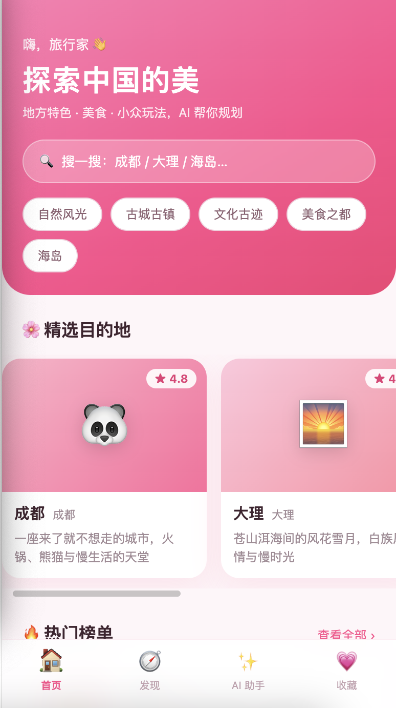
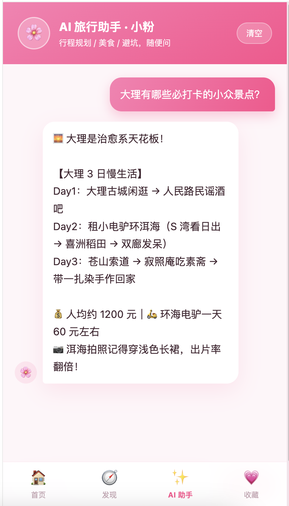

# 粉色旅记 · Pink Travel

移动端旅游 App：**React 19 + TypeScript + Zustand**（粉色主题）+ **Java 17 + Spring Boot 4.0 + Maven + MySQL 8**，
内置 **AI 旅行助手「小粉」（SSE 流式输出）** 与各地 **地方特色 / 美食 / 攻略** 介绍。

```
pink-travel/
├── package.json              # 便捷脚本：npm run mock / dev / backend / backend:h2
├── frontend/                 # React 19 + TS + Zustand（Vite，端口 5174）
├── preview/mock-server.mjs   # ⚠️ 仅供前端预览的 Mock 服务（端口 8080）
├── backend/                  # 真实后端：Spring Boot 4 + Java 17 + Maven + MySQL 8（端口 8080）
├── docs/home-preview.png     # 界面预览图
└── README.md
```

> **Mock 与 Java 后端接口完全一致、同样监听 8080，二选一启动即可，不要同时运行。**
> `GET /api/health` 可区分：Mock 返回 `mode: "mock"`，Java 返回 `mode: "java"`。

## 页面效果
##### 页面显示




---

## 一、快速开始

### 1. 前端（必装）

```bash
npm run install:web    # 等价于 cd frontend && npm install
npm run dev            # http://localhost:5174
```

### 2. 后端二选一

**方式 A：Node Mock（最快，零依赖，无需 Java/MySQL）**

```bash
npm run mock               # 等价于 node preview/mock-server.mjs → http://localhost:8080
```

**方式 B：真实 Java 后端（Spring Boot 4 + MySQL 8）**

```bash
cd backend

# ① 确保本机 MySQL 8 已启动（默认 root/123456，可用环境变量覆盖）
#    数据库 pink_travel 会自动创建、表会自动建、8 条目的地数据自动播种

./mvnw spring-boot:run                       # 本机没装 Maven 也能跑（wrapper 自动下载）

# 没有 MySQL？用内存库 H2 直接体验：
./mvnw spring-boot:run -Dspring-boot.run.profiles=h2
```

环境变量（可选）：

| 变量 | 说明 | 默认 |
|---|---|---|
| `MYSQL_USER` / `MYSQL_PASSWORD` | MySQL 账号密码 | root / 123456 |
| `DASHSCOPE_API_KEY` | 阿里云百炼 API-KEY，配置后走真实大模型；不配则本地模拟流式回复 | 空 |
| `AI_MODEL` | 模型名 | qwen-plus |

Windows 上把 `./mvnw` 换成 `mvnw.cmd`（或直接用 IDE 运行 `PinkTravelApplication`）。

---

## 二、Mock 接口如何用 Java 实现（对照表）

原来 `preview/mock-server.mjs` 里的每个接口，在 Spring Boot 工程里都有对应实现：

| Mock 中的位置 | Java 中的位置 |
|---|---|
| `handleChatStream()` SSE 流式输出 | `controller/ChatController#stream` → `service/AiChatService#stream`（`SseEmitter` + `WebClient` 调百炼） |
| `buildMockReply()` 本地模拟回复 | `AiChatService#buildMockReply`（未配 API-KEY 时自动回退） |
| `GET /api/destinations` 列表筛选分页 | `controller/DestinationController#list` → `service/DestinationService#search` |
| `GET /api/destinations/featured` | `DestinationController#featured` → `DestinationRepository#findByFeaturedTrue` |
| `GET /api/destinations/:id` | `DestinationController#detail` |
| `GET /api/categories` | `DestinationController#categories` |
| `DESTINATIONS` 种子数据 | `entity/Destination`（JPA 实体）+ `service/DataSeeder`（启动自动播种） |
| `json()` / CORS 头 | `controller/GlobalExceptionHandler` + `config/WebConfig` |

**关键差异**：Mock 的数据写死在 `data.mjs`，Java 版存 **MySQL 8**（`destinations` 表 + 3 张子表存特色/美食/标签），
接口出参结构完全一致，所以前端无需任何改动即可从 Mock 切到真实后端。

### AI 流式是怎么实现的（Java）

```
浏览器 fetch POST /api/chat/stream
        ↓  (text/event-stream)
ChatController → AiChatService
        ├─ 有 DASHSCOPE_API_KEY：WebClient 调百炼 /chat/completions (stream=true)
        │                        逐片解析 choices[0].delta.content → SseEmitter 转发
        └─ 无 KEY：本地按 3 字/35ms 模拟流式，效果一致，方便离线开发
        ↓
data: {"type":"delta","content":"你好"}
data: {"type":"done"}
```

前端 `src/api/client.ts` 的 `streamChat()` 用 `ReadableStream` 逐块解析，Zustand `chatStore` 累积文本，实现打字机效果。

---

## 三、接口一览（Mock 与 Java 一致）

| 方法 | 路径 | 说明 |
|---|---|---|
| GET | `/api/health` | 健康检查（区别 mock / java） |
| GET | `/api/categories` | 分类列表 |
| GET | `/api/destinations?category=&keyword=&page=&size=` | 列表（分类筛选、关键词搜索、分页） |
| GET | `/api/destinations/featured` | 精选目的地 |
| GET | `/api/destinations/{id}` | 详情（地方特色 / 必体验 / 美食 / 季节 / 预算） |
| POST | `/api/chat/stream` | AI 助手流式对话（SSE） |

请求示例：

```bash
curl "http://localhost:8080/api/destinations?category=美食之都"
curl -N -X POST http://localhost:8080/api/chat/stream \
  -H 'Content-Type: application/json' \
  -d '{"message":"帮我规划成都三日游","history":[]}'
```

---

## 四、前端结构（React 19 + TS + Zustand）

```
frontend/src/
├── types.ts                     # 全部接口类型（严格 TS 约束）
├── api/client.ts                # fetch 封装 + SSE 流解析
├── stores/
│   ├── destinationStore.ts      # 目的地列表/精选/筛选（Zustand）
│   ├── chatStore.ts             # AI 对话状态 + 流式累积
│   └── favoritesStore.ts        # 收藏（persist 持久化）
├── pages/
│   ├── HomePage.tsx             # 首页：精选横滑卡 + 热门榜 + AI 入口
│   ├── ExplorePage.tsx          # 发现：搜索 + 分类筛选
│   ├── DetailPage.tsx           # 详情：地方特色 / 必体验 / 美食，一键问 AI
│   ├── AiPage.tsx               # AI 助手流式聊天
│   └── FavoritesPage.tsx        # 收藏
└── styles/global.css            # 粉色主题设计系统
```

- 粉色主题：主色 `#ff4d8d`，渐变头部、圆角卡片、粉色阴影，移动端 430px 容器 + 底部 Tab
- 类型约束：`strict: true` + `noUnusedLocals` + `verbatimModuleSyntax`，`npm run typecheck` 可全量检查

---

## 五、生产化建议

- 种子数据 `DataSeeder` 仅供演示，正式数据请通过运营后台维护
- `ddl-auto: update` 建议改为 `none`，用 Flyway / Liquibase 管理表结构
- SSE 超时默认 120s，长回答可按需调整 `AiChatService` 中的 `SseEmitter` 超时
- 列表检索目前为内存过滤（数据量小）；数据量上来后改用 JPA `Specification` + 索引
- 前端 `npm run build` 产物 `frontend/dist` 交给 Nginx，`/api` 反代到 8080
